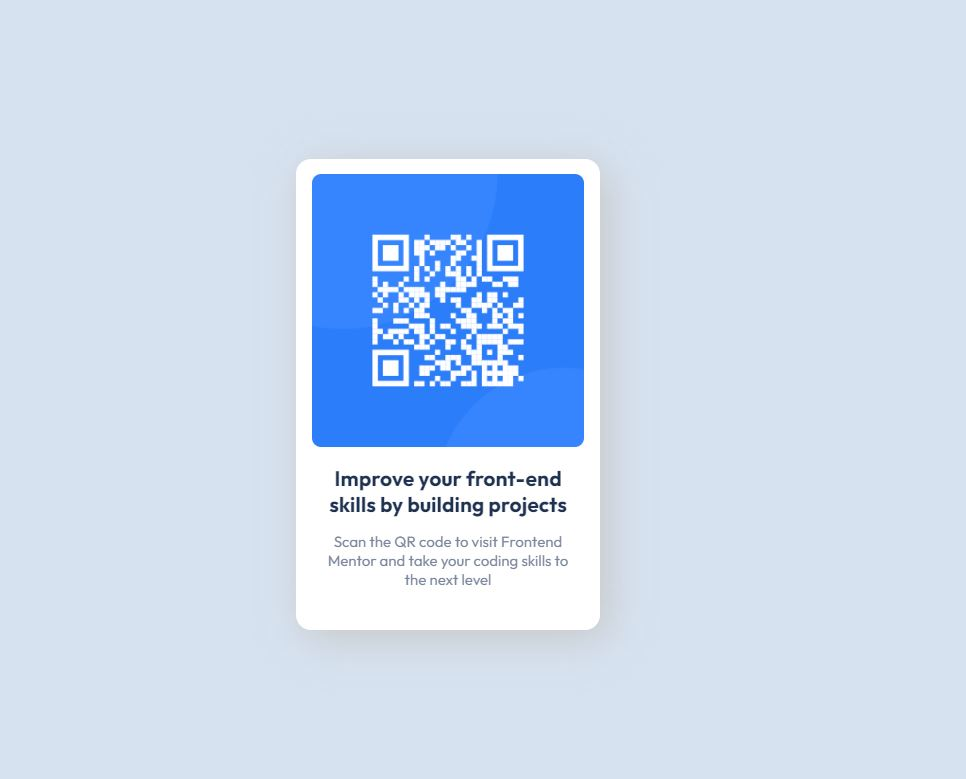
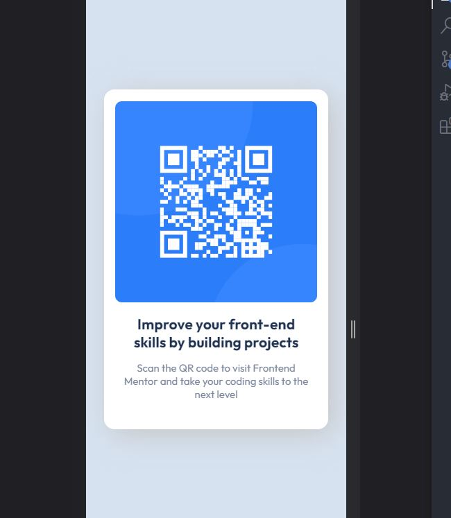

- [Overview](#overview)

    My first attempt using the website to practice HTML/CSS skills. The most intimidating thing was setting up all the pre-requesites, not the coding itself!

  - [Screenshot](#screenshot)

   

  

  - [Links](#links)

- [My process](#my-process)

  - [Built with](#built-with)

    VSCode. Since this is all local, nice to just reference the images from my local drive.

    Began with all the basic HTML, was straight forward nesting divs, placing an image, an h1 and p tags.

  - [What I learned](#what-i-learned)

    Never used [hsl] before, learned that.

    Tried to round the image border radius unsuccessfully, troubleshooted by adding a new [div] and nested image, but realized my border-radius syntax was wrong last time. Lost 5 minutes doing this.

    Learned how to navigate Google Fonts and link their API, use appropriate fonts

    Came to a point where I needed to decide how to format the text. Either create a new central div column to house both the h1 and p or just size them manually. I believe the former is more scalable, not sure what is best practice here. 

    Realized this wasn't responsive design. Backtracked some more. Problem with overflow of h1 content, trying to keep it in two lines. 
    Decided to wrap the text all in one div and inherit its properties instead.

    Added drop shadow. Refactored code due to repetition (text align, font family).

    Created media query for mobile version.

    I learned the ReadMe add image syntax too!

  - [Continued development](#continued-development)

    Responsive design is the biggest challenge, continue working out what looks good, how to scale it properly.

    Realized you should design mobile first, will do this next project.

  - [Useful resources](#useful-resources)

- [Author](#author)

    Michael D

- [Acknowledgments](#acknowledgments)

    I love how thorough the explanation was to initialize this project. Thanks to the team!
